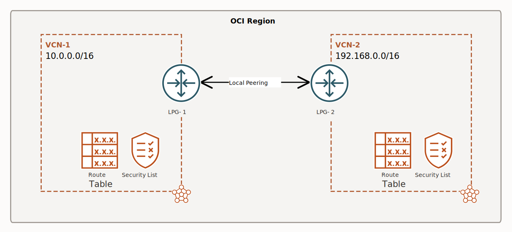
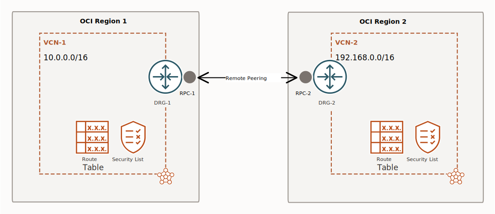

# Connectivity

## About This File

This file discusses how to connect VCNs in the same region as well as VCNs in different regions.

This file also covers the scenarios to connect VCNs to on-premises environments.

## Local VCN Peering

The process of connecting two VCNs within the **SAME region** is called Local Peering.

There are two options for Local Peering:

- LP Gateways
- DRG

> LP Gateways and DRG are virtual routers.

### Local Peering Gateways

A VCN can gave up to 10 local peering gateways.

LP Gateways provide extremely high bandwidth and low latency.

Requirements to use LP gateways:

- IP addresses in the VCN should NOT overlap.
- A LP gateway in each VCN.
- Establish Peering Connection (basically open one LP gateway and set the connection with the other LP gateway). You only need to do it in one side and wait until the peering status is Peered.
- Supporting routing table entries to send the traffic over the LP gateways.
- Supporting Security Lists to allow the desired traffic.

**📢IMPORTANT📢**: A VCN can't use its peered VCN to reach other destinations outside of the VCNs (such as the internet). For example, if VCN-1 in the preceding diagram were to have an internet gateway, the instances in VCN-2 couldn't use it to send traffic to endpoints on the internet. However, VCN-2 could receive traffic from the internet by way of VCN-1. 

Further reading:

https://docs.oracle.com/en-us/iaas/Content/Network/Tasks/localVCNpeering.htm

### Dynamic Routing Gateway v2

1 VCN can be attached to 1 DRG, and 1 DRG can have up to 300 VCN attachments.

Requirements to use DRGv2:

- IP addresses in the VCN should NOT overlap.
- Create a single DRG.
- Create VCN attachments to the DRG (this is done inside the DRG).
- Supporting routing table entries to send the traffic over the DRG.
- Supporting Security Lists to allow the desired traffic.

## Remote Peering

In the previous sections we saw how to connect VCNs when they are in the same region, now we are going to see how to connect VCNs that reside in different regions.

The process of connecting two VCNs that reside in **DIFFERENT regions** is called Remote Peering.

Remote Peering is done using Dynamic Routing Gateway. It allows VCNs in the same OR different tenancy to communicate (note: when using a DRG for local peering this is also true).

> Note: Remote peering allows instances from different VCNs in different regions to communicate using **PRIVATE IP ADDRESSES**. The advantage is that this communication is private.

Requirements for remote peering:

- IP addresses in the VCNs should NOT overlap.
- Create a DRG.
- Create VCN attachments to the DRG.
- Create a remote peering connection (RPC) on each DRG (RPCs are created inside the DRG).
- Establish a connection between the RPCs (this connection is done inside the RPC, you will need to provide the region of the other RPC and its OCID).
- Supporting routing table entries to send the traffic over the DRG.
- Supporting Security Lists to allow the desired traffic.

Further reading: https://docs.oracle.com/en-us/iaas/Content/Network/Tasks/scenario_e.htm

## Connecting VCN To On-Premises Environments

There are three option to connect with On-premises environments:

- Public Internet
- Site-to-site VPN
- Fast Connect

### Public Internet

This option typically uses Internet Gateway or NAT Gateway.

### Site-to-site VPN

A site-to-site VPN in OCI is a **secure** connection between your on-premises network and your VCN using **IPsec** (Internet Protocol Security) tunnels.

This enables **secure**, **encrypted** communication over the public internet.

### Fast Connect

Oracle Cloud Infrastructure FastConnect is a **dedicated**, private connection between OCI and your environment, with port speeds from 1G to 400G and no per-byte charge for data movement.

https://www.oracle.com/cloud/networking/fastconnect/

## Border Gateway Protocol

In simple words:

`Border Gateway Protocol (BGP) is the routing protocol for the Internet.`

Routing protocols are divided in 2:

- **Interior Gateway Protocols (IGPs)**: OSPF, EIGRP, RIP, etc.
- **Exterior Gateway Protocols (EGPs)**: BGP

Key terms:

- **internet**: the term "internet" is usually used to refer to a collection of networks interconnected with routers.
- **Internet: (note the capital "I")** The Internet is the largest internet in the world.
- **Autonomous System**: An AS is a network that is manage under a single administrative authority (a company, a university, a hospital, etc.). IGPs are used inside autonomous systems. The Internet is a global connection of Autonomous Systems.
- **Autonomous System Number**: Each AS has a number which identifies the whole network.
- **BGP**: Border Gateway Protocol is used to shared routing information between autonomous systems.
- **BGP Peer**: A device that resides at the edge of a network that exchange routing information using BGP.

### Why BGP Is Important for OCI

Two of the three option to connect OCI to on-premises environments use BGP:

1. Internet

Use BGP:

2. Site-to-site VPN
3. Fast Connect

> Site-to-site VPN can use either BGP or static routing (or a combination of both), Fast Connect always uses BGP.